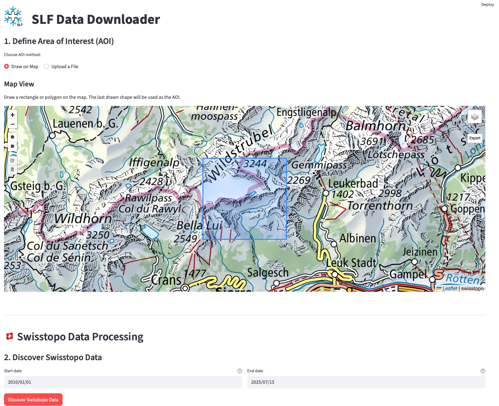

# SLF swisstopo Data Downloader
## An Interactive Tool for Downloading and Processing DEM and optical data from swisstopo

[](https://www.python.org/) [](https://streamlit.io) [](https://opensource.org/licenses/MIT)

**Status:** Actively Developed (as of July 2025)

Welcome! This repository contains an interactive Streamlit application designed to simplify the discovery, download, and processing of official geospatial data from **Swisstopo**.



---

## Table of Contents

* [Features](#features)
* [Installation](#installation)
* [Usage](#usage)
* [Input & Output](#input--output)
* [License](#license)

---

## Features

* **Interactive AOI Definition**: Define your Area of Interest by drawing directly on a map or by uploading a vector file (`.gpkg`, `.geojson`, `.zip`).
* **Automated Data Discovery**: Connects to the official Swisstopo STAC API to find available data for your AOI and specified date range.
* **Key Product Support**: Downloads and processes major Swisstopo datasets:
    * **swissALTI3D** (Digital Terrain Models - DTM)
    * **swissSURFACE3D** (Digital Surface Models - DSM)
    * **SWISSIMAGE** (High-resolution color orthophotos)
* **Automated Processing**:
    * Downloads all required data tiles.
    * Merges tiles into seamless mosaics.
    * Generates derived products like **hillshades** (monodirectional and multidirectional) and **grayscale** images.
    * Clips final outputs to the precise AOI boundary.
* **Organized Output**: Saves all generated GeoTIFFs into a clean, well-structured project directory.

---

## Installation

This guide assumes you have a Conda/Mamba installation. We recommend using `mamba` for faster environment creation.

```bash
# 1. Clone the repository and navigate into it
git clone "[https://github.com/your-username/swisstopo-downloader.git](https://github.com/your-username/swisstopo-downloader.git)" slf-swisstopo-downloader
cd slf-swisstopo-downloader

# 2. Create and activate the conda environment
# This command uses the environment.yml file to install all dependencies.
mamba env create -f env/environment.yml
conda activate slf-swisstopo-downloader
```
---

## Usage

Once the environment is activated, you can launch the application with a single command:

```bash
streamlit run swisstopo_downloader.py
```

This will open the interactive user interface in your web browser.

### In-App Workflow
1.  **Define AOI**: Use the map to draw a polygon or upload your own AOI file.
2.  **Discover Data**: Set a date range and click "Discover" to find available Swisstopo products.
3.  **Configure & Process**: Select the desired output products (e.g., DTM, hillshade) and click the "Download and Process" button.
4.  **Find Results**: Check the output directory you specified to find your processed GeoTIFF files.

## Input & Output

### Input
* **Area of Interest (AOI)**: The primary input is an AOI, which can be:
    * Drawn directly on the map.
    * Uploaded as a GeoPackage (`.gpkg`), GeoJSON (`.geojson`), or a zipped Shapefile (`.zip`).

### Output
* **Format**: All processed geospatial data is saved as **GeoTIFF (`.tif`)** files.
* **Structure**: Outputs are saved in a user-defined base directory, organized into a project folder. Inside this folder, subdirectories are created for each data product and year, for example:
    * `MyProject/MyProject_swissALTI3D_2023/MyProject_swissALTI3D_dem_2023.tif`
    * `MyProject/MyProject_swissALTI3D_2023/MyProject_swissALTI3D_hillshade_mono_2023.tif`

---

## License
This project is licensed under the **MIT License**. See the `LICENSE` file for details.

---

## Collaborators

The project is developed by the following contributors:

<div align="left">
  <a href="https://github.com/fdenzinger">
    <br>
    Florian Denzinger
  </a>
</div>


© 2025 WSL Institute for Snow and Avalanche Research SLF
